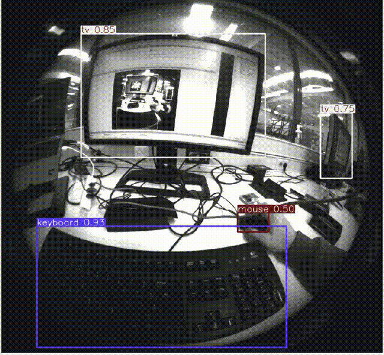

# YOLOv9 + Intel RealSense T265 ROS 2 Package


---

## 📁 Overview

This **ROS 2 package** combines real-time **visual odometry and fisheye image capture** from an Intel **RealSense T265 camera** with **YOLOv9 ONNX detection** to run inference on fisheye images.

### Nodes:
- **`t265_node` (C++)**
  - Publishes T265 fisheye images, IMU, and odometry.
- **`yolo_detector.py` (Python)**
  - Runs YOLOv9 object detection.
    
<div align="center">
  
</div>


## 🚀 Installation & Setup

### 1. Prerequisites
- ROS 2 Humble
- `librealsense2`
- `onnxruntime` GPU runtime installed to `/opt/onnxruntime`
- `ultralytics` Python package (`pip install ultralytics`)

### 2. Clone and Build
```bash
cd ~/ros2_ws/src
git clone https://github.com/RubenCasal/fisheye_yolo_realtime.git
cd ~/ros2_ws
colcon build --packages-select yolo_face_detection
source install/setup.bash
```

---

## 🏃️ Run the Nodes

### Launch both camera and detector:
```bash
ros2 launch yolo_face_detection yolo_detector_launch.py
```

### Alternatively, run nodes separately:
```bash
ros2 run yolo_face_detection t265_node
ros2 run yolo_face_detection yolo_detector.py
```

---

## 📰 Published Topics

| Topic                              | Type                          | Description                           |
|-----------------------------------|-------------------------------|---------------------------------------|
| `/rs_t265/fisheye_left`           | `sensor_msgs/msg/Image`      | Left camera grayscale image           |
| `/rs_t265/fisheye_right`          | `sensor_msgs/msg/Image`      | Right camera grayscale image          |
| `/rs_t265/imu`                    | `sensor_msgs/msg/Imu`        | Accelerometer + gyroscope             |
| `/rs_t265/odom`                   | `nav_msgs/msg/Odometry`      | Odometry from pose tracking           |
| `/rs_t265/yolo_detector_node`     | `sensor_msgs/msg/Image`      | Annotated image with YOLO detections  |

---

## 🎥 Visualize in RViz2
```bash
rviz2
```
Add the following topics:
- `/rs_t265/fisheye_left` → Image
- `/rs_t265/yolo_detector_node` → Image
- `/rs_t265/odom` → Odometry
- `/tf` → TF


## 📦 Model Export (PT ➔ ONNX)
To perform inference within a ROS 2 environment, we need to convert the YOLOv9 model from its original PyTorch format (.pt) to ONNX. This is because the ROS 2 nodes leverage the ONNX Runtime for efficient and accelerated inference, especially when utilizing CUDA.
Why Convert to ONNX?

The transformation from PyTorch to ONNX involves restructuring the model to be more compatible with deployment environments. During the export process:

- The computational graph is optimized and serialized.

- The model becomes hardware-agnostic, allowing for efficient execution on different platforms.

- The ONNX format supports hardware acceleration, making it ideal for real-time applications in robotics.

How Does It Affect the Model Architecture?

During the conversion, the model architecture is adapted to:

- Replace dynamic operations with static graph definitions, which are easier to optimize.

- Adjust layer representations to be compatible with ONNX standards.

- Integrate CUDA support directly into the exported graph, enabling efficient GPU inference.

Exporting the Model to ONNX:
```python
from ultralytics import YOLO
model = YOLO("yolov9m.pt")
model.export(format="onnx")

```
This will generate a .onnx file that can be loaded and used by the YOLO detection node inside your ROS 2 package.
